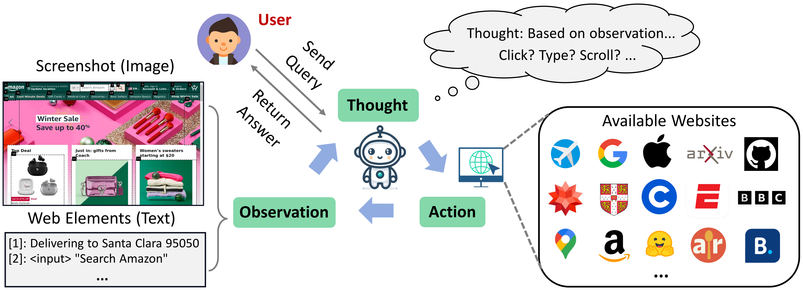

<div align="center">
<h1> WebPriceCompare 

<br> Multi-Site Price Comparison Web Agent </h1>
</div>

<div align="center">


</div>

<div align="center">

</div>

## Introduction

This repository contains the code for **WebPriceCompare**, an AI-powered web agent designed to compare product prices across multiple e-commerce websites. This project is based on **WebVoyager** ([original repo](https://arxiv.org/abs/2401.13919)) and has been modified to enable automated price comparisons.

### Key Features
- **Multi-Site Price Comparison**: The agent browses multiple e-commerce websites and extracts product prices for comparison.
- **Automated Web Interaction**: Uses Selenium to navigate, search for products, and extract price information.
- **AI-Powered Decision Making**: Uses GPT-4o-mini to determine the lowest price and generate a final decision.
- **Support for Dynamic Pages**: Handles pages with AJAX loading, pop-ups, and accessibility tree-based navigation.

## Setup Environment

### Prerequisites
1. Ensure that **Google Chrome** is installed. (The latest Selenium version does not require ChromeDriver installation.)
2. If running on a **Linux server**, install Chromium (e.g., for CentOS: \`yum install chromium-browser\`).

### Installation
Create a Conda environment and install dependencies:
\`\`\`bash
conda create -n webpricecompare python=3.10
conda activate webpricecompare
pip install -r requirements.txt
\`\`\`

## Data

### Task Format
Each task specifies a product to search for and a list of e-commerce websites to check. The dataset format follows:
\`\`\`json
{
    "id": 1,
    "product": "a portable Bluetooth speaker with a water-resistant design",
    "websites": [
        "https://www.amazon.com",
        "https://www.bestbuy.com",
        "https://www.walmart.com"
    ],
    "ques": "Find the product on each website. Only answer the best one."
}
\`\`\`
The dataset is stored in \`data/tasks_test.jsonl\`.

## Running

### Running WebPriceCompare
1. Add product queries in \`data/tasks_test.jsonl\`.
2. Set your OpenAI API key in \`run.sh\`.

#### **Method 1: Using Bash Script (\`run.sh\`)**
Run the agent:
\`\`\`bash
bash run.sh
\`\`\`

#### \`run.sh\` Example
\`\`\`bash
#!/bin/bash
nohup python -u run.py     --test_file ./data/tasks_test.jsonl     --api_key YOUR_OPENAI_API_KEY     --headless     --max_iter 15     --max_attached_imgs 3     --temperature 1     --fix_box_color     --seed 42 > test_tasks.log &
\`\`\`

#### **Method 2: Windows Direct Execution**
For **Windows users**, you can run the agent directly:
\`\`\`powershell
"C:\Users\user\AppData\Local\Programs\Python\Python310\python.exe" run.py --temperature 0.0 --test_file data/tasks_test.jsonl --api_key "YOUR-OPENAI-API-KEY" --api_model gpt-4o-mini
\`\`\`

### Output
- Screenshots and interaction logs are stored in the \`results/\` directory.
- The final decision on the **lowest price** is printed and logged.

## Parameters

- \`--test_file\`: JSON file with product queries.
- \`--max_iter\`: Maximum number of interactions per task.
- \`--api_key\`: OpenAI API key for processing.
- \`--output_dir\`: Directory for storing results.
- \`--download_dir\`: Directory for downloading files (if needed).
- \`--headless\`: Run without opening a visible browser.
- \`--max_attached_imgs\`: Number of screenshots to retain for context.
- \`--text_only\`: Enable text-based navigation (without images).
- \`--temperature\`: Control randomness of AI responses.

## Results and Evaluation

After execution, the system selects the lowest-priced product and generates a final report. Example output:

\`\`\`
Product: Bluetooth speaker (黑色)
Website: Amazon
Price: $21.99

Product: JBL Go4 Bluetooth Wireless Speaker
Website: Target
Price: $39.99
\`\`\`


> **Reflection Agent’s Analysis**  
> - Compared **Bluetooth speaker (黑色)** (Amazon, $21.99) vs. **JBL Go4 Bluetooth Wireless Speaker** (Target, $39.99)  
> - Noted that the JBL brand offers stronger reputation, higher quality and better user trust, despite higher cost  
> - **Conclusion:** Chose **JBL Go4 Bluetooth Wireless Speaker** for its reliable performance and brand value

```text
Product: JBL Go4 Bluetooth Wireless Speaker
Website: Target
Price: $39.99
```

> **Debater Agent’s Feedback**  
> - **Accept: Yes**  
> - **Explanation:** The reflection clearly compared brand reputation, pricing, and long‑term value, and the reasoning for selecting the JBL product is sound and helpful to potential buyers.

---

## Agent Architecture (New Update)
- **Executor Agent**: Drives the browsing loop, calls GPT‑4o-mini to generate “Thought”/“Action”, parses them, and executes via Selenium.  
- **Error Grounding Agent**: After each action (>1), analyzes screenshot vs. intended Thought, returns \`Errors: Yes/No\` + explanation, which is injected into the next prompt.  
- **Reflection Agent**: After collecting multiple candidate products, compares on brand reputation, discount, shipping, and outputs a detailed chain‑of‑thought final recommendation.  
- **Debater Agent**: Reviews the Reflection Agent’s decision (Accept: Yes/No). If rejected, triggers a re‑reflection cycle.  

## Error Analysis & Strategy Adjustment (New Update)
- **Structured Error History**: All failures (\`error_type\`, \`iteration\`, \`message\`) are logged into a global \`error_history\`.  
- **Automated EGA Calls**: Each iteration wraps a call to the Error Grounding Agent, feeding back errors into prompts for self‑correction.  
- **Format & Exception Handling**:  
  - Enhanced \`extract_information\` supports multiple scroll syntaxes and auto‑fills missing \`Thought:\`.  
  - Main loop catches stale element references, invalid indices, and format errors—logging and retrying accordingly.

## Prompt Enhancements (New Update)
- **System Prompts** now enforce:  
  - **“Scroll at least twice and collect ≥2 candidates before final decision.”**  
  - **“Use only \`Answer; …\` for the final answer.”**  
  - **Reference to \`error_history\`** so the agent can leverage past failures.  
- **\`SYSTEM_PREVIOUS_STEP\`** upgraded with 6 concrete guidelines (avoid repeats, always scroll, heed EGA feedback, etc.).  
- Separate constants for Reflection, Debater, Orchestration, and EGA prompts, clarifying each agent’s contract.

## Utility Functions Enhancements (New Update)
- **Scroll Parsing**: \`extract_information\` now handles both \`Scroll [n]; down\` and \`Scroll down; [n]\`.  
- **\`print_message\` Simplification**: Only skips \`system\` messages and extracts the final “Answer” into structured product info.  
- **Context Clipping**: Improved \`clip_message_and_obs(_text_only)\` for screenshots, PDFs, and text‑only modes to keep prompts concise.

## CLI & Run Enhancements (New Update)
- **New Flags**:  
  - \`--trajectory\`: record full iteration history in prompts.  
  - \`--error_max_reflection_iter\`: max retries for re‑reflection cycles.  
- **Message Formatting**:  
  - \`format_msg\` / \`format_msg_text_only\` accept a \`prev_step_action\` block to inject review history + EGA feedback.  
  - \`sanitize_messages\` hides system internals when calling sub‑agents.  
- **Logging**: \`setup_logger\` now captures all agent interactions (Executor, EGA, Reflection, Debater) in \`agent.log\` for full traceability.

---

## Citation

If you use or modify this project, please also consider citing the original WebVoyager paper:
\`\`\`
@article{he2024webvoyager,
  title={WebVoyager: Building an End-to-End Web Agent with Large Multimodal Models},
  author={He, Hongliang and Yao, Wenlin and Ma, Kaixin and Yu, Wenhao and Dai, Yong and Zhang, Hongming and Lan, Zhenzhong and Yu, Dong},
  journal={arXiv preprint arXiv:2401.13919},
  year={2024}
}
\`\`\`

## Disclaimer

This project is **not** an official product and does not guarantee accurate results due to the dynamic nature of web pages, AI decision-making, and API changes. Users should verify extracted data before use.
